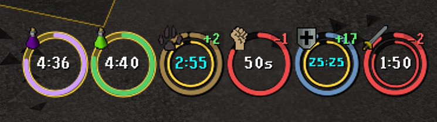

# Ring of Time

Ring of Time makes buffs, debuffs, and timed effects easier to understand at a glance. Instead of searching for and reading a timer, you can see how much time remains through a shrinking ring.

## Features

- Separate ring for every active skill or effect
- Stack rings into resizable groups with adjustable spacing and padding
- Outer ring shows the total remaining duration
- Optional inner rings show the next stat change, poison hit, prayer regeneration, or thrall cooldown
- Configurable ring size, thickness, outlines, colors, and labels
- Independent positions for skill and effect icons, plus custom countdown and +/- positions
- Display either the skill change (`+5`) or effective level (`105`)
- Optional flashing when beneficial effects are about to expire
- Preserve-aware buff timers with cyan countdown text while Preserve is active
- Separate controls for buffs, debuffs, and protection effects

## Supported skill changes

Ring of Time tracks ordinary one-level buff decay and debuff recovery for:

- Attack, Strength, Defence, Ranged, and Magic
- Mining, Agility, Smithing, Herblore, and Fishing
- Thieving, Cooking, Crafting, Firemaking, and Fletching
- Woodcutting, Runecraft, Slayer, Farming, and Construction
- Hunter and Sailing
- Most ordinary potions, spicy stews, Saradomin brews, Dragon battleaxe changes, and stat-draining attacks
- Divine super attack, strength, defence, combat, ranging, magic, bastion, and battlemage potions

## Supported effects

- Poison
- Venom
- Antipoison protection
- Anti-venom protection
- Stamina
- Prayer regeneration potions
- Regular and extended antifire
- Super and extended-super antifire
- Summoned thralls with an inner resurrection-cooldown ring

Poison and venom rings show the next damage cycle. Poison also shows its projected natural cure time.
